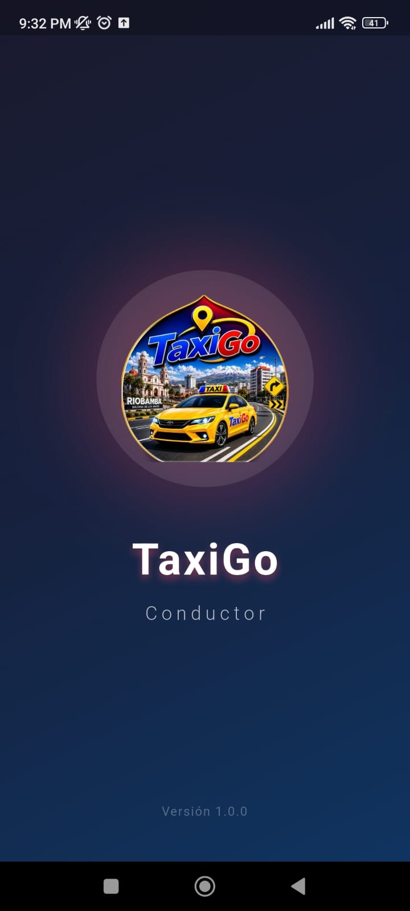
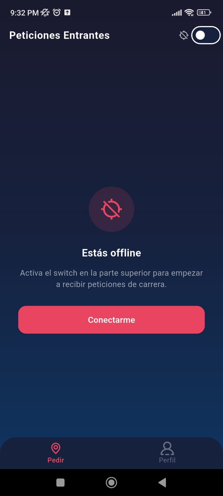
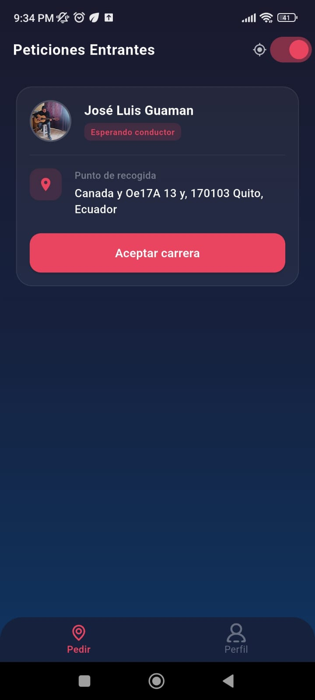
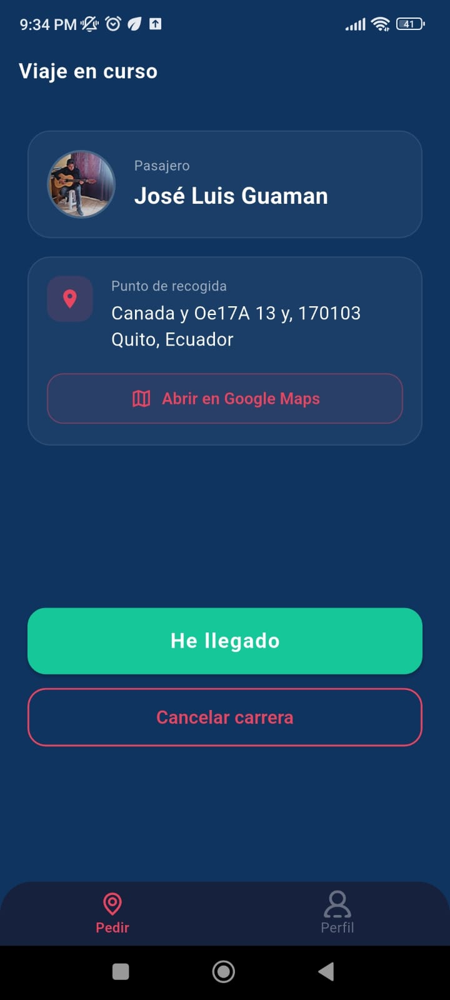
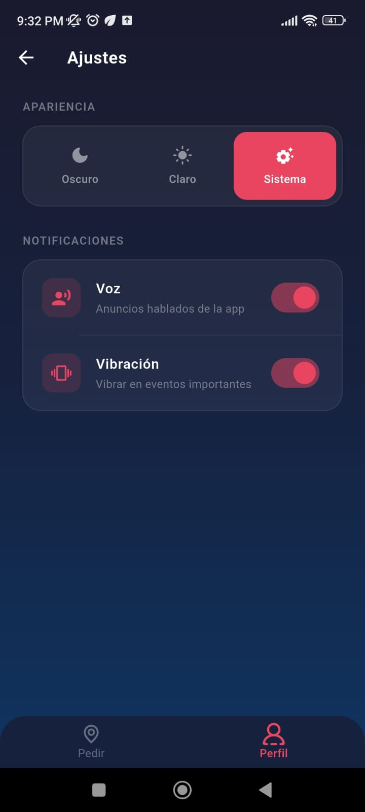
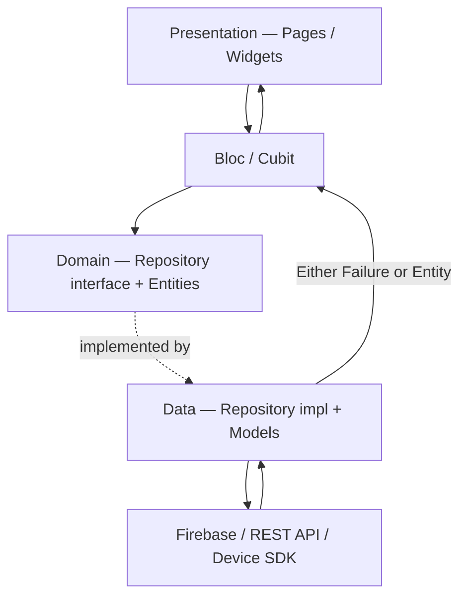
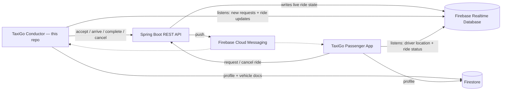

<div align="center">


# TaxiGo Conductor

**The driver-side app of TaxiGo — a real-time taxi dispatch platform built for the city of Riobamba, Ecuador.**

[](https://flutter.dev)
[](https://dart.dev)
[](https://firebase.google.com)
[]()
[](https://github.com/areascript22/project-taxi-driver/actions)
[]()

[Overview](#-overview) • [Screenshots](#-screenshots) • [Architecture](#-architecture) • [Tech Stack](#-tech-stack) • [Testing](#-testing) • [CI/CD](#-cicd) • [Getting Started](#-getting-started)

</div>

---

## 📖 Overview

**TaxiGo Conductor** is the driver-facing half of **TaxiGo**, a two-sided, real-time taxi-hailing system: this app, a companion **[passenger app](https://github.com/areascript22/project-taxi-passenger)**, and a private **Spring Boot** backend, all wired together through **Firebase** for live data and push notifications.

It's not a CRUD toy project — it's a small production system that solves the problems any real dispatch platform has to solve: **race conditions between drivers competing for the same ride**, **background location tracking that survives OEM battery managers**, **offline/latency-tolerant UX**, and **driver verification via an internal admin back-office** — all covered by an automated test suite.

The app is live on Google Play (internal testing track), shipped through a fully automated CI/CD pipeline.

## 📱 Screenshots

<table>
<tr>
<td align="center"><br/><sub><b>Splash</b></sub></td>
<td align="center"><br/><sub><b>Offline state</b></sub></td>
<td align="center"><br/><sub><b>Incoming ride request</b></sub></td>
</tr>
<tr>
<td align="center"><br/><sub><b>Trip in progress</b></sub></td>
<td align="center"><br/><sub><b>Settings</b></sub></td>
<td></td>
</tr>
</table>

## ✨ Key Features

- 🔐 **Auth & session** — Google Sign-In on top of Firebase Auth, with session persistence and auto-restore on app relaunch.
- 🧑‍💼 **Driver onboarding** — multi-step registration for personal data + vehicle info, with document/photo capture uploaded to Firebase Storage.
- 📡 **Real-time ride requests** — a live Firebase Realtime Database stream of incoming requests, with a guard against double-tap "accept" races between drivers.
- 🚕 **Full trip lifecycle** — accept → driver arrived → in progress → completed / cancelled. The critical transitions are enforced **server-side** (Spring Boot) to prevent two drivers from accepting the same ride.
- 🗣️ **Voice + vibration alerts** — the app speaks the destination address out loud and vibrates on every new ride request, driven from a **dedicated foreground-service isolate** so it keeps working even when the app is closed.
- 🔋 **Resilient background location** — a foreground location service that keeps reporting GPS while the driver is online, including a battery-optimization exemption flow that handles MIUI's asynchronous permission reconciliation.
- 🔔 **Push notifications** — Firebase Cloud Messaging for ride assignment/cancellation events while the app is killed.
- 🛠️ **Admin back-office** — an in-app admin screen to search, paginate, inspect and remove drivers/vehicles, built as a lightweight alternative to a separate web dashboard.
- 🌓 **Theming & preferences** — light/dark/system theme, voice and vibration toggles.
- 🗺️ **Native navigation handoff** — one tap to open the pickup address directly in Google Maps.
- ✅ **120 automated tests** (unit + Bloc) covering every business rule, success path, failure path and edge case.
- 🚀 **Automated release pipeline** — signed, flavored builds shipped straight to the Play Store.

## 🏗️ Architecture

The app follows a **feature-based Clean Architecture**, strictly layered and enforced by convention (see [`CLAUDE.md`](./CLAUDE.md) for the full internal style guide used while building this codebase):

```
UI  →  Bloc / Cubit  →  Repository / Service  →  Firebase · REST API · Device SDK
```

- **No `datasource` layer** — repositories/services talk to Firebase, the REST API or the device SDK directly; there's no redundant indirection for its own sake.
- **Functional error handling** — every repository/service method returns `Future<Either<Failure, Entity>>` (via `dartz`). Exceptions never propagate up; they're caught, logged and converted to a typed `Failure`.
- **Model ↔ Entity separation** — `data/models` know how to (de)serialize; `domain/entities` are plain, framework-free business objects. The UI and Blocs never see a raw Model.
- **Dependency Injection** — each feature owns a `get_it` service locator (`init<Feature>DI`), registered independently, so features stay decoupled and easy to test in isolation.

<div align="center">



</div>

### The bigger picture

This app is one half of a real-time, two-sided marketplace:

<div align="center">



</div>

The Spring Boot API owns the source of truth for ride state transitions (accept/cancel/complete), which are moved server-side specifically to avoid race conditions between concurrently-connected drivers — Firebase Realtime Database is used purely for low-latency fan-out of state changes to both clients.

### Project structure

```
lib/
 ├─ core/            # Cross-cutting: network (Dio client), error types, theming, routing
 ├─ shared/          # Reusable across features: geolocation, voice, vibration, notifications,
 │                    # foreground service, session, settings, feedback
 └─ feature/
     ├─ auth/                # Google Sign-In + session bootstrap
     ├─ driver_profile/      # Driver + vehicle onboarding
     ├─ incoming_request/    # Live ride-request feed, online/offline toggle
     ├─ trip/                # Trip lifecycle (arrive / complete / cancel)
     ├─ profile/             # Driver profile management
     └─ admin/               # Internal driver/vehicle back-office
         ├─ presentation/    # pages, widgets, bloc
         ├─ domain/          # entities, repository contracts
         ├─ data/            # repository implementation + models
         └─ di/              # feature-scoped service locator
```

## 🧰 Tech Stack

| Category | Technology |
|---|---|
| Language & Framework | Dart 3.7, Flutter 3.29 |
| State management | `flutter_bloc` / `bloc` (Bloc pattern only — no ad-hoc `setState`) |
| Dependency Injection | `get_it`, one locator per feature |
| Functional error handling | `dartz` (`Either<Failure, T>`) |
| Networking | `dio` + `dio_smart_retry` |
| Realtime data | `firebase_database` — live ride & location state |
| Auth / Data / Storage | `firebase_auth`, `google_sign_in`, `cloud_firestore`, `firebase_storage` |
| Push notifications | `firebase_messaging`, `flutter_local_notifications` |
| Location | `geolocator`, `flutter_background_service` (foreground tracking) |
| Voice & haptics | `flutter_tts`, `vibration` |
| Navigation handoff | `map_launcher` |
| Routing | `go_router` |
| Config | `flutter_dotenv` (per-flavor `.env`) |
| Testing | `flutter_test`, `bloc_test`, `mocktail` |
| CI/CD | GitHub Actions → Google Play (internal track) |

## ✅ Testing

The project ships with **120 automated tests** — pure unit tests for helpers plus full `bloc_test` suites for every Bloc (`auth`, `admin`, `driver_onboarding`, `incoming_request`, `profile`, `trip`, `session`, `settings`, `foreground_service`, `location`), using **mocktail** to mock repositories and services.

Each Bloc is tested for its **initial state**, the **success path** (`Right`), the **failure path** (`Left(Failure)`), **guard clauses** that should make an event a no-op, and — where the Bloc listens to a `Stream` (Firebase Realtime Database, Geolocator's position stream) — the **full sequence of emitted states**, including how the Bloc reacts to a stream error.

```bash
flutter test
```

## 🚀 CI/CD

Every push to the `qa` branch triggers a GitHub Actions pipeline that:

1. Decodes the flavor-specific `.env` file and `google-services.json` from encrypted secrets.
2. Restores the signing keystore and builds a **signed, flavored App Bundle** (`dev` / `prod` flavors, distinct `applicationId` per flavor).
3. Uploads the `.aab` straight to the **Google Play internal testing track**.

No manual build-and-upload step — a merge to `qa` is a release candidate on real devices within minutes.

## 🏁 Getting Started

```bash
git clone https://github.com/areascript22/project-taxi-driver.git
cd project-taxi-driver
flutter pub get
```

**1. Environment variables** — the app reads its backend URL from a per-flavor `.env` file (default path `assets/env/.env_dev`, overridable via `--dart-define=ENV_FILE=...`):

```env
BASE_URL=https://your-backend.example.com
```

**2. Firebase** — this repo doesn't ship `google-services.json` (it's injected by CI from a secret). To run locally, add your own Firebase Android config under `android/app/src/dev/google-services.json` (and `/prod` for the prod flavor) using [FlutterFire](https://firebase.flutter.dev/docs/cli/).

**3. Run:**

```bash
flutter run --flavor dev --dart-define=ENV_FILE=assets/env/.env_dev --dart-define=FLAVOR=dev
```

## 🔗 Related repositories

- 🙋 **[TaxiGo Passenger App](https://github.com/areascript22/project-taxi-passenger)** — the rider-facing Flutter app, same architecture.
- ☕ TaxiGo backend — a private Spring Boot REST API that owns ride-state transitions and drives Firebase fan-out.

---

<div align="center">

Built and maintained by **[@areascript22](https://github.com/areascript22)** — feel free to reach out.

</div>
